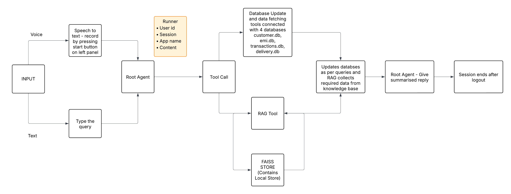

# CrediFlow

CrediFlow is an intelligent banking assistant built with Google Gemini, LangChain, and Streamlit. It provides a conversational interface for users to manage banking operations such as transactions, bill payments, EMI management, card services, delivery tracking, and knowledge-based queries through a Retrieval-Augmented Generation (RAG) system.

## Features

### Core Capabilities
- Secure login and signup system using hashed credentials.
- Conversational banking agent powered by `gemini-2.5-flash` and Google ADK.
- Retrieval-Augmented Generation (RAG) for answering banking-related knowledge queries.
- Transaction processing, refunds, and billing updates.
- EMI creation, schedule tracking, and EMI payments.
- Block and request credit cards.
- Track card delivery status.
- Fetch bank statements, bills, dues, and customer details.
- Persistent user sessions via Google ADK's `InMemorySessionService`.

### Frontend Interface
- Built with Streamlit.
- Dark theme UI with custom styling.
- Chat-style interaction for user-agent messages.
- Voice input support included in the `app_with_voice.py` version.

````

## Installation

1. Clone the repository:
   ```bash
   git clone <repository-url>
   cd <project-folder>
```

2. Install dependencies:

   ```bash
   pip install -r requirements.txt
   ```

3. Set up environment variables:
   Create a `.env` file containing:

   ```
   GOOGLE_API_KEY=your_api_key_here
   GOOGLE_GENAI_USE_VERTEXAI=FALSE
   ```

4. Ensure the SQLite database files (`customers.db`, `transactions.db`, `delivery.db`, `emi.db`) exist and follow the expected schema.

## Running the Application

### Standard UI

```bash
streamlit run app.py
```

### Voice-enabled UI

```bash
streamlit run app_with_voice.py
```

### Command-line agent (optional)

```bash
python agent.py
```

## RAG Module

The RAG component uses:

* FAISS vector store
* Google Generative AI embeddings (`models/embedding-001`)
* `Gemini 2.5 flash` for answer generation

Knowledge base files must be pre-ingested into `faiss_store`.

## Session Handling

Sessions are created per user using:

* Google ADK `Runner`
* `InMemorySessionService`
* Customer ID used as the unique session key

Each message includes a context header with the active customer ID to ensure accurate tool usage.

## Database Structure

The application relies on four SQLite databases:

* `customers.db`
* `transactions.db`
* `delivery.db`
* `emi.db`

These support:

* Customer profiles and card details
* Billing dues and transactions
* Card delivery records
* EMI schedules, payments, and loan metadata

## Agent Tooling

The agent uses the following tools defined in `tools.py`:

* `fetch_details`
* `transaction_details`
* `bank_statement`
* `bill_details`
* `process_transaction`
* `pay_bill`
* `emi_creation`
* `emi_details`
* `emi_pay`
* `block_account`
* `delivery_status`
* `request_card`
* `create_alert`
* `collection_alert`
* `RAG_query`

Each tool interacts with the appropriate SQLite database and returns JSON-formatted responses.

## Notes

* The application relies on Google Gemini models and requires a valid API key.
* For voice input, install `streamlit-mic-recorder`.
* Conversation sessions persist across reloads until sign out.

## License

This project is licensed under the MIT License.




